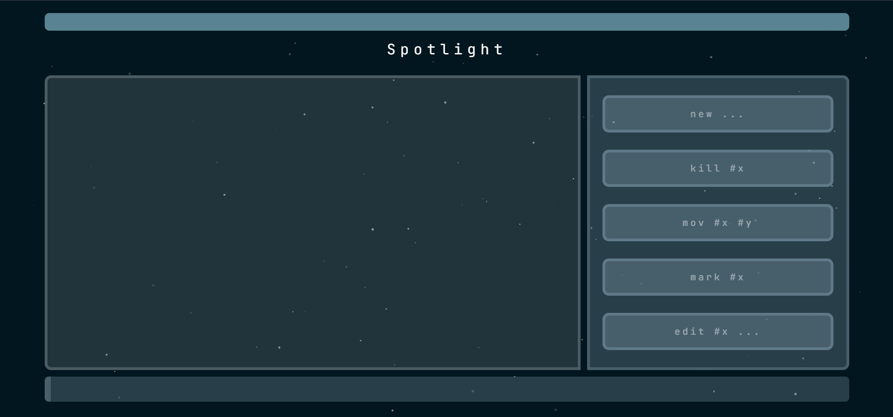

# 🌟 Spotlight

**Spotlight** is a powerful productivity platform built to help students manage their time, organize their work, and make their study process more efficient — all in one place.

---

## 🚀 Features

- **🔐 Authentication System**  
  Sign up, sign in, and log out seamlessly with secure cookie-based authentication.

- **🧠 Smart To-Do List**  
  An interactive, real-time task manager that lets you plan your study sessions with precision and ease. Check things off, edit on the go, and never lose track of your goals.

- **📆 Timetable Manager**  
  A sleek, customizable weekly schedule to track your subjects, classes, or focus blocks. Visualize your day and organize it your way.

- **🧑‍💻 Study Rooms with Google Meet**  
  Create or join dedicated study rooms — complete with instant Google Meet integration — so you can collaborate and stay accountable with your peers.

---

## 🛠 Built With

- **Node.js + Express.js** – Backend server
- **MongoDB** – Database for users and schedules
- **HTML/CSS/JavaScript** – Interactive frontend
- **Cookie Parser + Dotenv** – Secure sessions and environment control

---

## 👨‍💻 Made By

Crafted with dedication and a love for tech by **Hursh Bajaj**, an EXUN member with a vision for streamlined student productivity.

---

## 📂 Getting Started (Local Setup)

Just run these in your command-line to get the site up and running. (BASH)

[env format] <br>
EMAIL_USER= <br>
EMAIL_PASS= (app password)<br>
MONGO_URI= <br>

```bash
git clone https://github.com/hurshbajaj/Spotlight-Dynamix
cd Spotlight-Dynamix
npm install
nodemon backend/app.js
```

## 🔧 How to use it

You will initially be greeted with something like   
<br>

<br>

Simply click on the cyan-green island at top very top to progress... taking you to the menu.


You must be signed in to access **Let's Go**. Authorization involves a mail being sent to you preferred gmail. After the same, you will be guided to (1) the TODO integration



A list of commands given on the right hand side will help you make your mundane planning much more comfortable & easier. *Example Command* 
<br>
```new dynamix submission | 23/07/2025```
<br>
**Note: The input field is the horizontal strip at the bottom of the page!
To navigate to the next page, use Shift + Enter until you will be brought back to /menu. Make sure to edit content in the (2) TIMETABLE integration you double click on the textbox / area and enter to save it. The (3) Study Room is fairly simple & self-explanatory as well.


